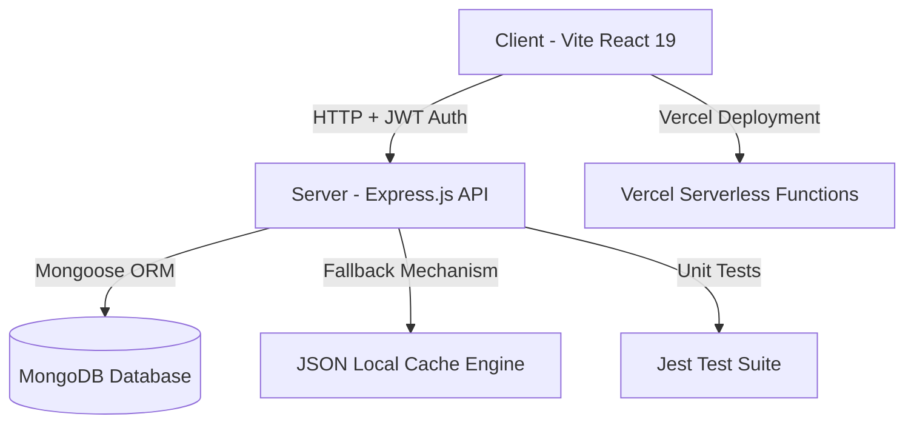

# 🎓 AbhyasTRE (अभ्यास TRE)
> **BPSC Teacher Recruitment Exam (TRE 4.0 / 3.0) & Bihar D.El.Ed Interactive Preparation Platform**


**AbhyasTRE** is a state-of-the-art, feature-rich, bi-lingual web application tailored specifically for candidates preparing for the **Bihar Public Service Commission (BPSC) Teacher Recruitment Examination (PRT, TGT, PGT)** and **Bihar D.El.Ed Course Examinations**.

---

## 🌟 Key Features

### 1. 📚 Multi-Level BPSC TRE Exam Support
- **PRT (Primary Teacher - Class 1 to 5)**
- **TGT (Middle Teacher - Class 6 to 8)**
- **TGT (Secondary Teacher - Class 9 to 10)**
- **PGT (Higher Secondary Teacher - Class 11 to 12)**

### 2. 🎯 Topic-Wise Subject Practice & Seeded Question Banks
- **Mathematics (20 Complete Topics)**: Work & Time, Pipes & Cisterns, Speed & Distance, Train/Boat/Stream, Percentage, Profit & Loss, Ratio & Proportion, Simple Interest, Compound Interest, Number System, Average & Ages, Mixture & Alligation, Algebra, Mensuration 2D/3D, Trigonometry, Geometry, Statistics & Probability, etc.
- **Reasoning (16 Complete Topics)**: Analogy, Classification, Series, Coding-Decoding, Blood Relations, Direction & Distance, Order & Ranking, Mathematical Operations, Syllogism, Venn Diagram, Dice & Cube, Calendar & Clock, Non-Verbal Reasoning, Statement & Assumptions/Conclusions, Seating Arrangement.
- **General Studies & Languages**: General Science, Geography, Polity, Indian National Movement, Environment, Current Affairs, Hindi, and English.

### 3. 🛡️ Secure Authentication & User Access Control
- Real Backend Auth powered by **bcryptjs** password hashing and **JSON Web Tokens (JWT)**.
- Protected endpoints (`/api/auth/register`, `/api/auth/login`, `/api/auth/me`).
- Account-level test attempt history tied strictly to individual user accounts (`userId`).
- Strict Email validation (`username@domain.extension`) & alphanumeric password rules.

### 4. 🔒 Anti-Cheating Data Protection & Server-Side Scoring
- Answer keys (`correct`) and solution explanations (`sol`) are automatically stripped from `GET /api/questions` responses to prevent client-side answer leaking in browser DevTools.
- `POST /api/attempts/submit` performs server-side evaluation by retrieving correct answers directly from DB/cache. Client-sent `correctOption` parameters are ignored.
- Calculates exact raw scores, 1/3 negative marking deductions, and net marks.

### 5. 🌐 Dual Language Support (Hindi & English)
- Instant one-click toggle between **Hindi (हिंदी)** and **English** across all questions, multiple-choice options, and detailed step-by-step explanations.

### 6. 📖 Bihar D.El.Ed Notes & Syllabus Hub
- Complete **1st Year (F-01 to F-12)** and **2nd Year (S-01 to S-08)** study material.
- Built-in PDF reader with page navigation, zoom control, and direct download support.

---

## 🏗️ Architecture & Technology Stack



### **Frontend**
- **Framework**: React 19 (Hooks, Context API)
- **Bundler**: Vite 6
- **Styling**: Modern Custom CSS3 (Glassmorphism, Dark/Light Mode adaptivity, responsive layouts)
- **Icons**: Lucide React
- **Animations & FX**: Canvas Confetti

### **Backend**
- **Runtime**: Node.js & Express.js
- **Authentication**: JWT (`jsonwebtoken`) & `bcryptjs`
- **Database**: MongoDB with Mongoose Schema validation
- **Testing**: Jest unit testing suite for scoring & negative marking logic
- **Caching & Fallback**: Dual-layer memory & local JSON cache (`questions_cache.json`) for serverless zero-downtime execution

---

## 📁 Repository Structure

```
AbhyasTRE/
├── client/                     # React Frontend Source
├── server/                     # Express Backend Server
│   ├── config/                 # DB Connection
│   ├── middleware/             # JWT Auth Middleware (auth.js)
│   ├── models/                 # Schemas (User, Question, Paper, Note, Attempt)
│   ├── routes/                 # API Routes (/api/auth, /api/questions, /api/attempts, etc.)
│   ├── utils/                  # Centralized Fallback & Sanitization Engine (fallback.js)
│   ├── tests/                  # Jest Unit Tests (scoring.test.js)
│   └── server.js               # Standalone Express Server
├── api/                        # Vercel Serverless Entrypoint (index.js)
├── data/                       # CSV Datasets & Cache Files
├── .env.example                # Root Environment Variables Template
├── .gitignore                  # Git Ignore Policies (node_modules, .env, *.pdf ignored)
├── package.json                # Monorepo Workspace Configuration
└── README.md                   # Project Documentation
```

---

## 🚀 Quick Start & Local Setup

### Prerequisites
- **Node.js**: `v18.x` or higher
- **npm**: `v9.x` or higher
- **MongoDB** (Optional): Local MongoDB at `mongodb://localhost:27017/abhyastre` or MongoDB Atlas URI.

### 1. Environment Setup
Copy `.env.example` to create your local `.env` file:
```bash
cp .env.example server/.env
```

### 2. Install Dependencies
```bash
npm install
```

### 3. Run Unit Tests
```bash
npm test
```

### 4. Start Development Servers
```bash
npm run dev
```

- **Frontend**: [http://localhost:5173](http://localhost:5173)
- **Backend API**: [http://localhost:5000/api](http://localhost:5000/api)

---

## ⚠️ Content Disclaimer & Copyright Notice

The study materials, notes, and question datasets in this repository are curated for educational and exam preparation purposes for candidates taking Bihar state teacher recruitment and D.El.Ed examinations. All trademarks, registered names, and study content belong to their respective copyright holders. If you are a copyright owner and wish to request attribution or removal of any specific study resource, please open an issue in this repository.

---

## 🛡️ License

This project is open-source and available under the [MIT License](LICENSE).
