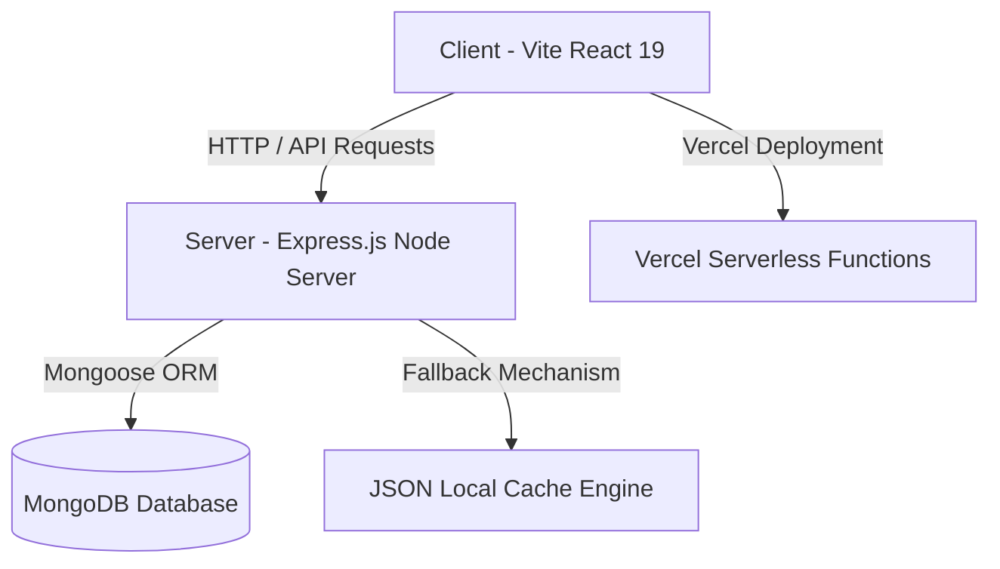

# 🎓 AbhyasTRE (अभ्यास TRE)
> **BPSC Teacher Recruitment Exam (TRE 4.0 / 3.0) & Bihar D.El.Ed Interactive Preparation Platform**


**AbhyasTRE** is a state-of-the-art, feature-rich, bi-lingual web application tailored specifically for candidates preparing for the **Bihar Public Service Commission (BPSC) Teacher Recruitment Examination (PRT, TGT, PGT)** and **Bihar D.El.Ed Course Examinations**.

---

## 🌟 Key Features

### 1. 📚 Multi-Level BPSC TRE Exam Support
- **PRT (Primary Teacher - Class 1 to 5)**
- **TGT (Middle Teacher - Class 6 to 8)**
- **TGT (Secondary Teacher - Class 9 to 10)**
- **PGT (Higher Secondary Teacher - Class 11 to 12)**

### 2. 🎯 Topic-Wise Subject Practice & Seeded Question Banks
- **Mathematics (20 Complete Topics)**: Work & Time, Pipes & Cisterns, Speed & Distance, Train/Boat/Stream, Percentage, Profit & Loss, Ratio & Proportion, Simple Interest, Compound Interest, Number System, Average & Ages, Mixture & Alligation, Algebra, Mensuration 2D/3D, Trigonometry, Geometry, Statistics & Probability, etc.
- **Reasoning (16 Complete Topics)**: Analogy, Classification, Series, Coding-Decoding, Blood Relations, Direction & Distance, Order & Ranking, Mathematical Operations, Syllogism, Venn Diagram, Dice & Cube, Calendar & Clock, Non-Verbal Reasoning, Statement & Assumptions/Conclusions, Seating Arrangement.
- **General Studies & Languages**: General Science, Geography, Polity, Indian National Movement, Environment, Current Affairs, Hindi, and English.

### 3. 🌐 Dual Language Support (Hindi & English)
- Instant one-click toggle between **Hindi (हिंदी)** and **English** across all questions, multiple-choice options, and detailed step-by-step explanations.

### 4. 📖 Bihar D.El.Ed Notes & Syllabus Hub
- Complete **1st Year (F-01 to F-12)** and **2nd Year (S-01 to S-08)** study material.
- Built-in PDF reader with page navigation, zoom control, and direct download support.

### 5. 🔒 Secure Authentication & Access Control
- Mandatory Sign-In guard for practice tests, PYQs, and downloadable notes.
- Strict Email validation (`username@domain.extension`).
- Enhanced Alphanumeric Password Security Policy (Minimum 8 chars, 1 uppercase, 1 lowercase, 1 digit, and 1 special character).

### 6. 📊 Real-Time Test Analytics & History Tracking
- Instant scorecard upon submission with accuracy breakdown, time analysis, and solution explanations.
- Persistent local & account-level quiz history drawer.

---

## 🏗️ Architecture & Technology Stack



### **Frontend**
- **Framework**: React 19 (Hooks, Context API)
- **Bundler**: Vite 6
- **Styling**: Modern Custom CSS3 (Glassmorphism, Dark/Light Mode adaptivity, responsive layouts)
- **Icons**: Lucide React
- **Animations & FX**: Canvas Confetti

### **Backend**
- **Runtime**: Node.js & Express.js
- **Database**: MongoDB with Mongoose Schema validation
- **Caching & Fallback**: Dual-layer memory & local JSON cache (`questions_cache.json`) for serverless zero-downtime execution
- **PDF Generation & Serving**: PDFKit & Static File Middleware

---

## 📁 Repository Structure

```
AbhyasTRE/
├── client/                     # React Frontend Source
│   ├── src/
│   │   ├── components/         # Reusable Components (SubjectPicker, NotesReader, AuthModal, etc.)
│   │   ├── context/            # Language & Theme Contexts
│   │   ├── data/               # Static Notes & Quiz Configurations
│   │   └── App.jsx             # Main Application Routing & State
│   ├── package.json
│   └── vite.config.js
├── server/                     # Express Backend Server
│   ├── config/                 # DB Connection & Environment Config
│   ├── models/                 # Mongoose Data Schemas (Question, Paper, Note, Attempt)
│   ├── routes/                 # Express API Endpoints (/api/questions, /api/notes, etc.)
│   ├── scripts/                # Data Seeding & PDF Generator Scripts
│   ├── data/                   # Server JSON Fallback Cache
│   └── server.js               # Standalone Express Server
├── api/                        # Vercel Serverless Function Entrypoint
│   └── index.js
├── data/                       # CSV Datasets for Maths & Reasoning
├── vercel.json                 # Vercel Full-Stack Deployment Config
├── package.json                # Monorepo Workspace Configuration
└── README.md                   # Project Documentation
```

---

## 🚀 Quick Start & Local Setup

### Prerequisites
- **Node.js**: `v18.x` or higher
- **npm**: `v9.x` or higher
- **MongoDB** (Optional): Running locally at `mongodb://localhost:27017/abhyastre` or MongoDB Atlas connection string.

---

## 💻 Running in VS Code (Step-by-Step)

1. **Open Project Folder in VS Code**:
   - Open **VS Code**.
   - Click `File -> Open Folder...` and select the `AbhyasTRE` folder.

2. **Open Integrated Terminal**:
   - Press `Ctrl + ~` (or go to `Terminal -> New Terminal`).

3. **Install Dependencies**:
   ```bash
   npm install
   ```

4. **Seed Question Data (Maths & Reasoning)**:
   ```bash
   # Seed 20 Mathematics Topics
   node server/scripts/seedMathsQuestions.js

   # Seed 16 Reasoning Topics
   node server/scripts/seedReasoningQuestions.js
   ```

5. **Start Dev Runner**:
   ```bash
   npm run dev
   ```

6. **Access App in Browser**:
   - Frontend Web App: [http://localhost:5173](http://localhost:5173)
   - Backend Express API: [http://localhost:5000/api](http://localhost:5000/api)

---

## ☁️ Deployment on Vercel

This repository is pre-configured for seamless full-stack deployment on **Vercel** via `vercel.json` and serverless functions in `api/index.js`.

### 1-Click Deployment via Vercel CLI
```bash
npx vercel --prod
```

### GitHub Integration Deployment
1. Push this repository to GitHub.
2. Import project in [Vercel Dashboard](https://vercel.com/new).
3. Vercel automatically detects `vercel.json` and builds both frontend static assets (`client/dist`) and serverless API endpoints (`api/index.js`).

---

## 🛡️ License

This project is open-source and available under the [MIT License](LICENSE).

---

<p center="align">
  Crafted with ❤️ for BPSC & D.El.Ed Aspirants across Bihar.
</p>
